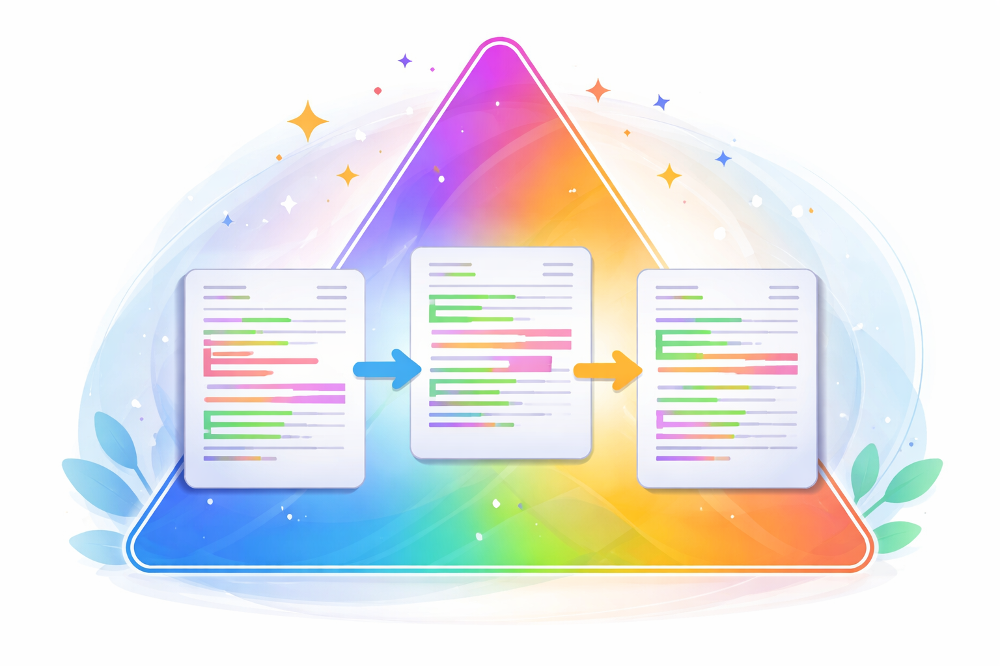

<p align="center">
  
</p>

<h1 align="center">DOCTA</h1>

<p align="center"><i>A tool for tracking and analyzing differences across documentation versions using semantic content extraction.</i></p>

---
<p align="center" style="font-weight: bold;"><i>This repository is under heavy construction.</i></p>

## Features

- **Hash-based delta detection**: Quickly identify changed, added, removed, and renamed documents
- **Semantic content comparison**: Extract and compare content blocks (headings, text, code, tables) while ignoring cosmetic HTML changes
- **Fuzzy rename detection**: Identify renamed/moved documents using similarity matching
- **Structured reporting**: Generate detailed JSON reports with change analysis
- **QA generation (optional)**: Generate question-answer pairs from documentation changes using RAGAS

## Requirements

- Python 3.11+ (3.12+ recommended)
- uv (package manager)

## Installation

Clone the repository and install dependencies:

```bash
git clone <repository-url>
cd doc-diff-tracker
uv sync
```

This installs the `doc-diff-tracker` CLI command.

## Quick Start

### Full Pipeline (Recommended)

Run both manifest comparison and semantic diffing in one command:

```bash
uv run doc-diff-tracker full-diff \
  --old-root data/rhel9_and_10/9 \
  --new-root data/rhel9_and_10/10 \
  --old-version "9" \
  --new-version "10" \
  --output-dir artifacts \
  --max-docs 50 \
  --allow-overwrite
```

This creates two reports:
- `artifacts/delta_report.json` - Hash-based change detection
- `artifacts/semantic_diff_report.json` - Detailed semantic content comparison

### Two-Stage Pipeline

You can also run the stages separately:

**Stage 1: Generate delta report**
```bash
uv run doc-diff-tracker compare \
  --old-root data/rhel9_and_10/9 \
  --new-root data/rhel9_and_10/10 \
  --old-version "9" \
  --new-version "10" \
  --output artifacts/delta_report.json \
  --allow-overwrite
```

**Stage 2: Semantic content comparison**
```bash
uv run doc-diff-tracker scan \
  --report artifacts/delta_report.json \
  --old-root data/rhel9_and_10/9 \
  --new-root data/rhel9_and_10/10 \
  --output artifacts/semantic_diff_report.json \
  --max-docs 50 \
  --allow-overwrite
```

## Commands

### `full-diff`
Combines manifest comparison and semantic diffing into one workflow.

**Options:**
- `--old-root` - Path to older documentation corpus
- `--new-root` - Path to newer documentation corpus
- `--old-version` - Label for old version (default: "9")
- `--new-version` - Label for new version (default: "10")
- `--output-dir` - Output directory for reports (default: "artifacts")
- `--rename-threshold` - Similarity threshold for rename detection (default: 85.0)
- `--max-docs` - Limit semantic comparison to N documents (default: all)
- `--include-modified` - Include modified docs in semantic scan (default: true)
- `--include-renamed` - Include renamed docs in semantic scan (default: true)
- `--allow-overwrite` - Allow overwriting existing files (default: false)
- `--allow-symlinks` - Process symlinked files (default: false)

### `compare`
Generate delta report by comparing file hashes and paths.

### `scan`
Perform semantic content extraction and comparison on a delta report.

### `qa-generator` (Optional)
Generate question-answer pairs from semantic diff reports using RAGAS.

**Options:**
- `--config, -c` - Path to YAML configuration file
- `--testset-size, -n` - Number of QA pairs to generate
- `--num-documents, -d` - Limit number of source documents
- `--format, -f` - Output format (json, yaml, auto)
- `--overwrite` - Allow overwriting existing output
- `--verbose, -v` - Enable verbose logging

## Output

### Delta Report
Contains lists of:
- `unchanged` - Files with identical content
- `modified` - Files with same path, different content
- `renamed_candidates` - Potential renames/moves (based on content similarity)
- `added` - New files in newer version
- `removed` - Files no longer present

### Semantic Diff Report
Detailed block-level changes:
- Section additions/removals/modifications
- Text content changes with similarity scores
- Code block changes
- Table structure and data changes
- List modifications
- Metadata changes

Changes are reported semantically (e.g., "Installation section: added 3 paragraphs") rather than as raw HTML differences.

## QA Generation (Optional)

The project includes an optional QA generation feature that uses [RAGAS](https://docs.ragas.io/) to generate question-answer pairs from semantic diff reports. This is useful for creating test datasets to evaluate RAG systems and documentation understanding.

> **Note**: The LLM provider implementation is currently using LangChain wrappers and will soon migrate to LiteLLM for broader provider support.

### Installation

Install the core package with QA generation dependencies:

```bash
uv sync --extra qa
```

This installs additional dependencies:
- `ragas>=0.4.3` - QA generation framework
- `langchain-core` - LangChain core functionality
- `langchain-google-genai` - Google Gemini integration
- `langchain-openai` - OpenAI integration
- `pyyaml` - YAML configuration support

**Note**: The `qa` extra includes heavy LLM dependencies (~50+ packages). Only install if you need QA generation capabilities.

### Quick Start

**1. Set up API key:**

```bash
# For Google Gemini
export GOOGLE_API_KEY="your-api-key"

# For OpenAI
export OPENAI_API_KEY="your-api-key"
```

**2. Generate QA pairs from a semantic diff report:**

```bash
qa-generator generate \
  artifacts/semantic_diff_report.json \
  output/qa_pairs.json \
  --config config/system.yaml \
  --testset-size 5 \
  --verbose \
  --overwrite \
  --num-documents 5
```

### Configuration

Create a YAML config file (see `config/system.yaml`):

```yaml
# LLM Configuration
llm:
  provider: google
  model: gemini-2.5-flash   
  temperature: 0.0              
  # max_tokens: 2048            

# Embedding Configuration
embedding:
  provider: google
  model: gemini-embedding-2-preview    

# Generation Settings
generation:
  testset_size: 10              # Number of QA pairs to generate

  # Query Distribution - must sum to 1.0
  query_distribution:
    specific: 1.0       # SingleHopSpecificQuerySynthesizer (simple factual, single context)
    abstract: 0         # MultiHopAbstractQuerySynthesizer (reasoning, multiple contexts)
    comparative: 0      # MultiHopSpecificQuerySynthesizer (comparisons, multiple contexts)


# Filtering Configuration
# Controls which documentation changes are used for QA generation

  # Change types to include
  change_types:
    - text_change               # Text content changes (recommended)
    # - structure_change        # Structural changes (sections added/removed)
    # - metadata_change         # Metadata changes (titles, attributes)

```

### Output Format

Generated QA pairs include full traceability metadata:

```json
{
  "question": "How do you enable two-factor authentication in IdM?",
  "ground_truth_answer": "Use the ipa config-mod command...",
  "source_topic_slug": "idm-authentication",
  "source_location": "chapters/security/2fa.html > h2#configuration",
  "source_change_type": "text_change",
  "source_versions": ["9.0", "9.1"],
  "question_type": "SingleHopSpecificQuerySynthesizer",
  "metadata": {
    "query_style": "factual"
  }
}
```

### Supported Providers

- **Google Gemini** - `langchain-google-genai` (API key required)
- **Google Vertex AI** - `langchain-google-vertexai` (ADC or service account)
- **OpenAI** - `langchain-openai` (API key required)


## Architecture

The project follows a modular architecture:

```
src/
├── doc_diff_tracker/         # Core diff tracking
│   ├── cli.py                    # CLI entry point (Typer-based)
│   ├── models/                   # Data models
│   │   ├── models.py            # Core delta report models
│   │   ├── content.py           # Content block models
│   │   └── html_diff.py         # Semantic diff models
│   ├── extract/                  # Content extraction
│   │   ├── content_extractor.py # HTML content extraction
│   │   └── block_differ.py      # Block-level diff logic
│   ├── compare/                  # Comparison logic
│   │   ├── lineage.py           # Manifest comparison & delta detection
│   │   └── semantic_diff.py     # Semantic content comparison
│   ├── output/                   # Report generation
│   │   └── reporting.py         # JSON report writers & summaries
│   └── utils/                    # Utilities
│       ├── inventory.py         # File scanning & hashing
│       ├── security.py          # Path validation & security
│       ├── scanner.py           # Delta report scanner
│       ├── cli_helpers.py       # CLI validation helpers
│       ├── text_utils.py        # Text processing utilities
│       └── constants.py         # Constants & configuration
└── qa_generation/            # QA generation (optional)
    ├── cli.py                    # QA generator CLI
    ├── config/                   # Configuration management
    │   └── settings.py          # Settings and YAML loading
    ├── models/                   # QA data models
    │   ├── qa_pair.py           # QA pair and source document models
    │   ├── provider_config.py   # LLM/embedding configuration
    │   └── report_ingestion.py  # Diff report ingestion models
    ├── generators/               # QA generation logic
    │   ├── base.py              # Generator protocol & errors
    │   └── ragas_generator.py   # RAGAS-based implementation
    ├── llm/                      # LLM provider abstraction
    │   └── provider.py          # LLM/embedding factory functions
    ├── ingest/                   # Data ingestion
    │   ├── diff_report_reader.py # Semantic diff report reader
    │   └── snippet_extractor.py  # Snippet filtering & extraction
    ├── output/                   # Output writers
    │   └── qa_writer.py         # JSON/YAML QA pair writers
    └── pipeline/                 # Orchestration
        └── orchestrator.py      # Full QA generation pipeline
```

### Key Components

**Core Diff Tracking:**
- **Manifest Building** (`utils/inventory.py`): Scans directories, computes file hashes, builds manifests
- **Delta Detection** (`compare/lineage.py`): Compares manifests, identifies changes, detects renames
- **Content Extraction** (`extract/content_extractor.py`): Parses HTML, extracts semantic blocks (headings, paragraphs, code, tables, lists)
- **Semantic Comparison** (`extract/block_differ.py`): Compares content blocks using fuzzy matching and similarity scoring
- **Security** (`utils/security.py`): Path validation, symlink protection, output validation

**QA Generation (Optional):**
- **Pipeline Orchestration** (`qa_generation/pipeline/orchestrator.py`): End-to-end QA generation workflow
- **Snippet Extraction** (`qa_generation/ingest/snippet_extractor.py`): Filters and extracts relevant text from diff reports
- **RAGAS Generator** (`qa_generation/generators/ragas_generator.py`): Generates QA pairs using RAGAS framework
- **LLM Provider** (`qa_generation/llm/provider.py`): Factory for LLM and embedding models (currently LangChain-based)
- **Traceability** (`qa_generation/models/qa_pair.py`): Maintains full metadata linking QA pairs to source changes

## Development

### Setup

```bash
# Install dependencies including dev tools
uv sync

# Install dev dependencies explicitly
uv add --dev black ruff mypy pyright pylint
```

### Code Quality

```bash
# Format code
uv run black .

# Lint
uv run ruff check .

# Type check
uv run pyright

# Security scan
uv run bandit -r src/
```

### Testing

Tests are not yet implemented (contributions welcome).

## Dependencies

### Core Dependencies

- **beautifulsoup4** - HTML parsing
- **html2text** - HTML to text conversion
- **lxml** - Fast XML/HTML processing
- **pydantic** - Data validation and settings
- **rapidfuzz** - Fuzzy string matching for rename detection
- **typer** - CLI framework

### Optional Dependencies (QA Generation)

Install with `uv sync --extra qa`:

- **ragas>=0.4.3** - QA test generation framework
- **langchain-core** - LangChain core functionality
- **langchain-google-genai** - Google Gemini LLM/embeddings integration
- **langchain-openai** - OpenAI LLM/embeddings integration
- **langchain-community** - Community LLM providers
- **pyyaml** - YAML configuration support

> **Planned**: Migration from LangChain providers to LiteLLM for broader model support

## Security

- Path traversal protection via `utils/security.py`
- Symlink validation (disabled by default, opt-in via `--allow-symlinks`)
- Output path validation
- Hash-based integrity checking