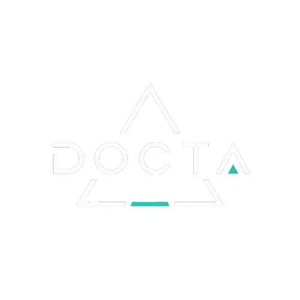

<p align="center">
  
</p>

<p align="center"><i>A tool for tracking and analyzing differences across documentation versions using semantic content extraction.</i></p>

---

## Features

- **Hash-based delta detection**: Quickly identify changed, added, removed, and renamed documents
- **Semantic content comparison**: Extract and compare content blocks (headings, text, code, tables) while ignoring cosmetic HTML changes
- **Fuzzy rename detection**: Identify renamed/moved documents using similarity matching
- **Automated polling daemon**: Monitor GraphQL APIs for documentation changes and trigger pipelines automatically
- **Structured reporting**: Generate detailed JSON reports with change analysis
- **QA generation (optional)**: Generate question-answer pairs from documentation changes using RAGAS

## Documentation

**Full documentation:** [https://arin-deloatch.github.io/docta/](https://arin-deloatch.github.io/docta/)

## Quick install

```bash
git clone https://github.com/arin-deloatch/docta
cd docta
uv sync
```

## Quick start

```bash
uv run docta diff full \
  --old-root data/docs_v1 \
  --new-root data/docs_v2 \
  --output-dir artifacts \
  --allow-overwrite
```

## Links

- [Documentation](https://arin-deloatch.github.io/docta/)
- [Contributing](CONTRIBUTING.md)
- [Security](SECURITY.md)
- [License](LICENSE)
- [Changelog](CHANGELOG.md)
